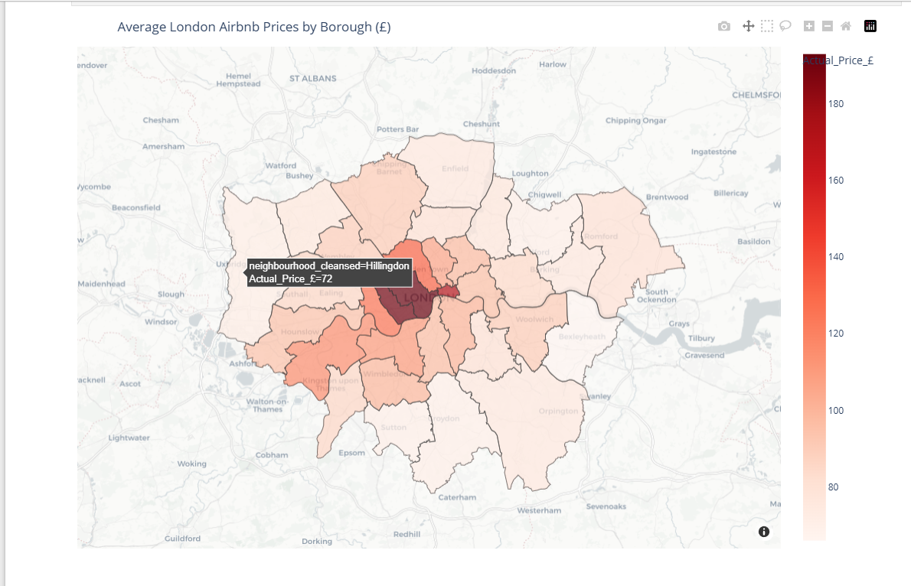

# 🇬🇧 London Airbnb Price Predictor

## 📌 Project Overview
This project is an end-to-end Machine Learning pipeline designed to predict the nightly price of short-term rentals in London. By analyzing over 80,000 real-world Airbnb listings, this project identifies the strongest drivers of rental value and maps the geospatial distribution of wealth across the city.

## 🛠️ Tools & Technologies Used
* **Python** (Data manipulation and modeling)
* **Pandas & NumPy** (Data cleaning, feature engineering, log transformations)
* **Scikit-Learn** (Linear Regression, Random Forest Regressor, GridSearchCV)
* **Plotly & Seaborn** (Interactive geospatial choropleth maps, correlation heatmaps)

## 📊 Key Insights
1. **Size Dictates Baseline:** Property capacity (accommodates, bedrooms) is the absolute strongest baseline predictor of a high nightly rate. 
2. **The Privacy Premium:** Offering a "Shared Room" severely penalizes the nightly rate compared to an "Entire Home".
3. **Location Multiplier:** Central and historic districts (Westminster, Kensington & Chelsea, City of London) act as massive multipliers on the baseline price.

## ⚙️ Model Performance
* Baseline Linear Regression: **58.0% Accuracy**
* Tuned Random Forest (GridSearchCV): **~66.7% Accuracy**
* *Note: The ~67% accuracy represents the "data ceiling" for these specific features. Further improvements would require scraping secondary data (e.g., host reviews, interior design image analysis).*

## 🚀 How to View the Project
Click on the `Airbnb_Price_Prediction (2).ipynb` file above to view the full code, interactive maps, and step-by-step documentation.
